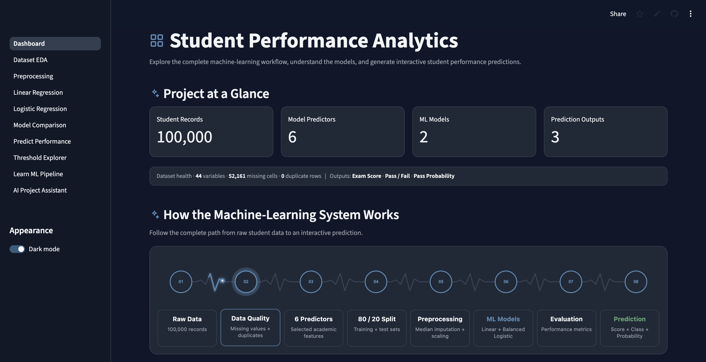
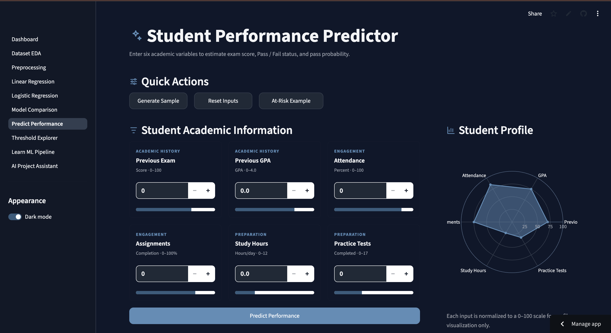
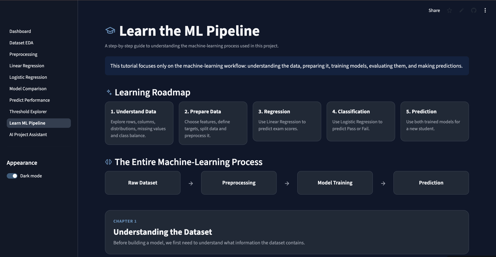
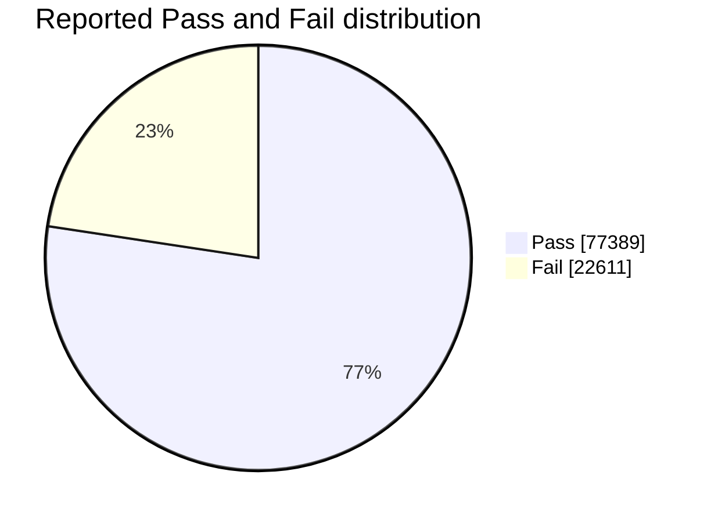
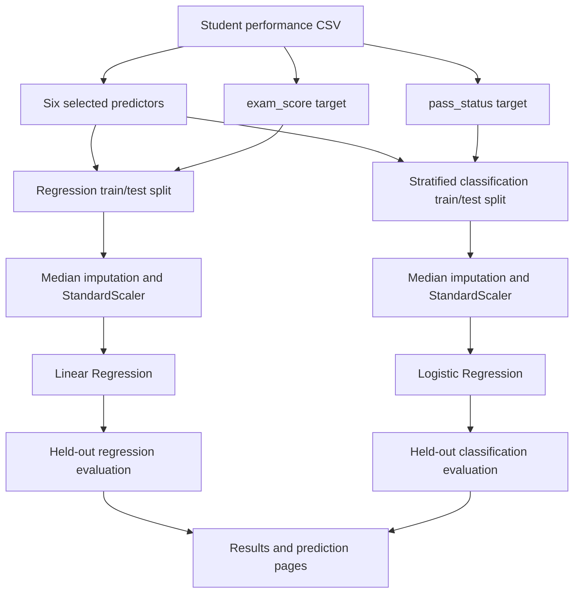
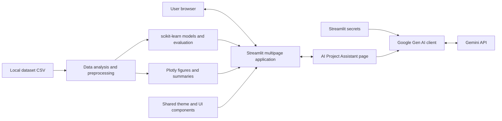
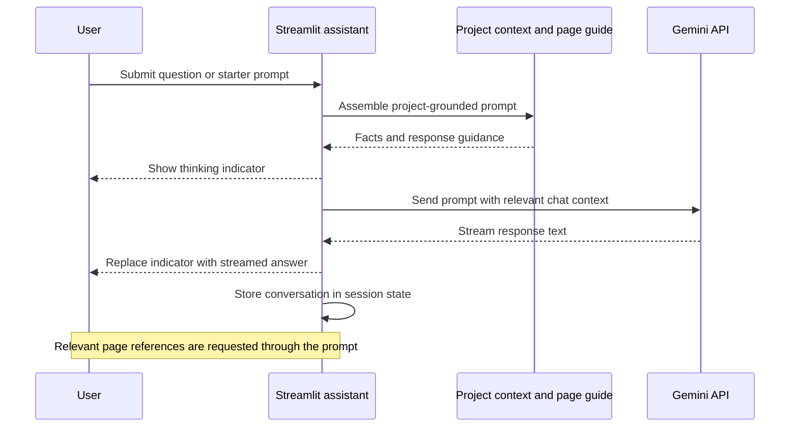

# Student Performance Analytics

An educational Streamlit application for exploring student data, predicting exam scores and Pass/Fail outcomes, and learning the machine-learning workflow through interactive pages and a Gemini-powered project assistant.

The project was developed for a machine-learning assignment. It combines dataset exploration, preprocessing, two separate prediction tasks, classifier comparison, scenario exploration, and beginner-friendly explanations in one application.

**Repository:** [Student Performance Analytics](https://github.com/fahimroy22/-student-performance-analytics)

> **Documentation scope:** This README reflects the implementation, results, and deployment progress recorded in the project conversation. Metrics are reported results, not a new evaluation. The source repository and deployed application were not independently audited for this document. Unspecified details are identified rather than supplied as assumptions.

🚀 **[Try the live app](https://fahim-student-result-prediction.streamlit.app/)**

## App preview

### Dashboard


### Predict Performance


### Learn ML Pipeline


## Contents

- [Overview](#overview)
- [Project pages](#project-pages)
- [Dataset summary](#dataset-summary)
- [Machine-learning workflow](#machine-learning-workflow)
- [Models and reported metrics](#models-and-reported-metrics)
- [Prediction and threshold exploration](#prediction-and-threshold-exploration)
- [System architecture](#system-architecture)
- [Technology stack](#technology-stack)
- [Documented project files](#documented-project-files)
- [Installation and local setup](#installation-and-local-setup)
- [Gemini AI assistant setup](#gemini-ai-assistant-setup)
- [Deployment](#deployment)
- [Security and privacy](#security-and-privacy)
- [Troubleshooting](#troubleshooting)
- [Limitations and reproducibility](#limitations-and-reproducibility)

## Overview

The application supports two distinct machine-learning tasks:

| Task | Model | Target | Output |
|---|---|---|---|
| Regression | Linear Regression | `exam_score` | Estimated exam score |
| Classification | Balanced Logistic Regression, with comparison baselines | `pass_status` | Predicted Pass/Fail class and Pass probability |

Both tasks use six selected predictors. The regression output does **not** directly determine the classification probability: the models are trained separately for different targets.

The application also provides:

- Dataset summaries, missing-value information, distributions, and feature relationships.
- Explanations of feature selection, imputation, scaling, and train/test splitting.
- Regression diagnostics and classification evaluation charts.
- Comparison of Dummy, Standard Logistic, and Balanced Logistic classifiers.
- Student input forms, model-based scenario simulation, and threshold exploration.
- A step-by-step ML learning page with code, explanations, outputs, and figures.
- A project-aware Gemini assistant with streamed answers and chat history.
- Shared light/dark appearance, themed charts, and reusable visual components.

## Project pages

The following routes are documented in the assistant's page guide. They are **application routes**, not GitHub file links. Open them beneath the running app's address; for example, append `/Preprocessing` to the local or deployed app URL.

| Page | App route | Purpose and content |
|---|---|---|
| Dashboard | `/` | Project overview; record and variable counts; missing values; duplicates; exam-score distribution; Pass/Fail overview |
| Dataset & EDA | `/Dataset_EDA` | Distributions, missing values, feature relationships, correlations, and class distribution |
| Preprocessing | `/Preprocessing` | Selected predictors, median imputation, StandardScaler, train/test split, and model-ready data |
| Linear Regression | `/Linear_Regression` | Training, exam-score prediction, actual versus predicted values, residuals, coefficients, MAE, RMSE, and R² |
| Logistic Regression | `/Logistic_Regression` | Pass/Fail training and prediction, probabilities, confusion matrix, classification metrics, ROC, and AUC |
| Model Comparison | `/Model_Comparison` | Dummy, Standard Logistic, and Balanced Logistic comparisons; accuracy versus balanced accuracy |
| Predict Performance | `/Predict_Performance` | Six student inputs, score estimate, class prediction, Pass probability, and scenario simulation |
| Threshold Explorer | `/Threshold_Explorer` | Classification threshold changes and their tradeoffs |
| Learn ML Pipeline | `/Learn_ML_Pipeline` | Beginner-focused ML walkthrough with code explanations, outputs, evaluation, and prediction examples |
| AI Project Assistant | `/AI_Project_Assistant` | Project questions, ML concepts, code explanations, result interpretation, and troubleshooting |

A useful learning sequence is Dashboard → Dataset & EDA → Preprocessing → the two model pages → Model Comparison → Predict Performance. Use Learn ML Pipeline for a guided explanation and AI Project Assistant for follow-up questions.

## Dataset summary

The documented CSV location is `data/student_performance.csv`.

| Property | Reported value |
|---|---:|
| Student records | 100,000 |
| Variables | 44 |
| Missing values | 52,161 |
| Duplicate rows | 0 |
| Pass records | 77,389 |
| Fail records | 22,611 |
| Pass share, rounded | 77.4% |
| Fail share, rounded | 22.6% |
| Selected predictors | 6 |

The missing-value total counts missing entries; it should not be read as the number of students with missing data. The dataset is imbalanced, with Pass representing the majority class.



*Figure 1. Class counts explain why overall accuracy alone is insufficient for comparing classifiers.*

### Selected predictors

| Column | Readable label |
|---|---|
| `previous_exam_score` | Previous exam score |
| `previous_gpa` | Previous GPA |
| `attendance_percentage` | Attendance percentage |
| `assignment_completion_rate` | Assignment completion rate |
| `study_hours_per_day` | Study hours per day |
| `practice_tests_completed` | Practice tests completed |

The targets are `exam_score` and `pass_status`. A complete dictionary of all 44 variables, the original dataset publisher, collection methodology, dataset license, and permitted input ranges are not established in the context used for this README.

## Machine-learning workflow

The documented preprocessing configuration uses median imputation, `StandardScaler`, and scikit-learn `Pipeline` objects. The train/test split is 80/20 with `random_state=42`; the classification split is stratified.

| Step | Configuration | Purpose |
|---|---|---|
| Select inputs | Six predictors listed above | Define the model inputs |
| Define targets | `exam_score`; `pass_status` | Separate regression from classification |
| Split data | 80% training / 20% testing | Evaluate predictions on held-out data |
| Preserve class proportions | Stratification for classification | Keep the class mix represented in each split |
| Fill missing predictors | Median imputation | Supply numeric values where inputs are missing |
| Scale predictors | `StandardScaler` | Put predictors on a comparable scale |
| Combine transformations and estimator | scikit-learn `Pipeline` | Apply a consistent preprocessing sequence during training and prediction |
| Evaluate | Task-specific metrics and plots | Examine error and class performance |

The figure shows the intended data flow. Imputation and scaling are fitted on training data; held-out data and new inputs should pass through the fitted transformations.



*Figure 2. The two prediction tasks use separate targets and pipelines. Both splits use an 80/20 ratio and random state 42.*

## Models and reported metrics

### Linear Regression

Linear Regression estimates `exam_score` from the selected predictors.

| Metric | Reported result | Interpretation |
|---|---:|---|
| MAE | 9.38 | Mean absolute prediction error in exam-score units |
| RMSE | 11.76 | Error measure that gives greater weight to large errors |
| R² | 0.444 | Approximately 44.4% of the evaluated target variation is explained relative to the mean-prediction reference |

R² is not a classification accuracy. MAE and RMSE describe error across evaluated records; they are not guaranteed error bounds for an individual student.

The Linear Regression page includes actual-versus-predicted plots, residuals, and coefficients. Coefficients describe associations in the fitted model, not causal effects of changing a student's behavior.

### Balanced Logistic Regression

The preferred classifier in the documented project is Logistic Regression with `class_weight="balanced"`, targeting `pass_status`.

| Metric | Reported result |
|---|---:|
| Accuracy | 72.5% |
| Precision | 90.6% |
| Recall | 71.9% |
| F1 | 80.1% |
| Balanced accuracy | 73.2% |
| ROC AUC | 0.814 |

Accuracy measures the overall fraction of correct predictions. Balanced accuracy averages recall across classes, giving each class equal importance. Precision, recall, and F1 describe classification performance under their evaluation label and averaging settings. AUC summarizes discrimination across thresholds; it does not establish probability calibration.

The metric summary does not explicitly identify the positive-label and averaging settings for precision, recall, and F1. Confirm those in the evaluation code before presenting them as Fail-detection metrics.

### Classifier comparison

| Classifier | Accuracy | Balanced accuracy |
|---|---:|---:|
| Dummy classifier | 77.4% | 50.0% |
| Standard Logistic Regression | 80.9% | 64.8% |
| Balanced Logistic Regression | 72.5% | 73.2% |

Standard Logistic Regression has the highest reported overall accuracy. Balanced Logistic Regression has the highest reported balanced accuracy, which supports its selection when performance across both classes matters.

The Dummy result illustrates the imbalance problem: high majority-class prevalence can produce an apparently strong accuracy while balanced accuracy remains only 50.0%. These results do not establish that the balanced model is best for every decision objective.

## Prediction and threshold exploration

On **Predict Performance**, users supply the six predictors and inspect an estimated exam score, predicted Pass/Fail outcome, and Pass probability. The page also supports model-based scenario simulation.

The regression and classification outputs should be interpreted separately. A score estimate and a Pass probability can appear inconsistent because they come from different models and objectives.

**Threshold Explorer** demonstrates how changing a classification threshold changes decisions. It helps explain the tradeoff between identifying more cases and increasing incorrect alerts. The exact threshold range, default value, and operating-policy recommendation are not specified here.

Scenario changes show how the fitted model responds to different inputs. They do not prove that making a particular real-world change will cause the predicted improvement.

## System architecture

Streamlit hosts the interface and Python application logic. The project uses a CSV for its dataset, pandas and NumPy for data handling, scikit-learn for modeling, Plotly for interactive charts, and Google Gemini for generated explanations.



*Figure 3. Conceptual architecture based on the documented components. The Gemini integration provides explanations; the scikit-learn models generate student performance predictions.*

### AI assistant behavior

The assistant is grounded through project context embedded in its prompt, including dataset totals, predictors, preprocessing, metrics, and a page guide. The documented design is prompt-based; repository search, live retrieval, and automatic synchronization of project facts are not established.

The final assistant iteration includes streamed responses, right-aligned user messages, left-aligned answers, a custom bot SVG rendered as an encoded image, a three-dot thinking indicator, theme-aware code blocks, code copy buttons, starter questions, and a **New chat** button. Chat history is stored in Streamlit session state.

Relevant answers are instructed to append **“Where this is used in the project”** with clickable internal page links. The final deployment discussion confirmed visible streaming and bot rendering but left consistent appearance of that reference section unverified.



*Figure 4. Assistant request and response flow. Generated text still requires verification.*

## Technology stack

| Technology | Documented role |
|---|---|
| Python | Application and machine-learning code |
| Streamlit | Multipage UI, widgets, session state, secrets, and response streaming |
| pandas | CSV loading and tabular data processing |
| NumPy | Numerical operations |
| scikit-learn | Imputation, scaling, splitting, pipelines, estimators, and metrics |
| Plotly Express / Graph Objects | Interactive figures |
| Google Gen AI SDK (`google-genai`) | Gemini API client, imported with `from google import genai` |
| HTML, CSS, SVG | Custom layouts, theming, code presentation, bot icon, and animation |
| Git and GitHub | Version control and deployment source |
| Streamlit Community Cloud | Hosted application deployment |

Exact dependency pins and a formally supported Python version are not established by this README. Use the repository's dependency configuration as the installation source of truth.

## Documented project files

This is a partial inventory of paths explicitly referenced in the conversation, not a claim about the complete repository tree.

| Path | Purpose |
|---|---|
| `Dashboard.py` | Streamlit entry point and dashboard |
| `data/student_performance.csv` | Dataset loaded by the ML learning page |
| `pages/01_Dataset_EDA.py` | Dataset exploration page |
| `pages/03_Linear_Regression.py` | Regression page |
| `pages/04_Logistic_Regression.py` | Classification page |
| `pages/06_Predict_Performance.py` | Prediction interface |
| `pages/07_Learn_ML_Pipeline.py` | Interactive ML tutorial |
| `pages/08_AI_Project_Assistant.py` | Gemini assistant |
| `components/styles.py` | Shared styling and theme helpers |
| `components/icons.py` | Reusable icon and heading helpers |
| `components/footer.py` | Shared footer |
| `requirements.txt` | Python dependencies |
| `.streamlit/secrets.toml` | Local secrets; must remain outside version control |
| `.gitignore` | Exclusions for local files and secrets |
| `retrain_models.py` | Trains and evaluates both model pipelines, then saves them to `models/` using joblib |
| joblib | Saves the trained preprocessing and model pipelines as `.pkl` files |

### Retraining the models

From the project root, with the project environment activated, run:

python retrain_models.py

The script:
1. Loads `data/student_performance.csv`.
2. Selects the six documented predictors.
3. Creates 80/20 train/test splits with `random_state=42`,
   using stratification for classification.
4. Fits median imputation and StandardScaler within each pipeline.
5. Trains Linear Regression and Balanced Logistic Regression.
6. Prints regression and classification evaluation metrics.
7. Saves both fitted pipelines using joblib.

Balanced Logistic Regression uses `class_weight="balanced"`,
`max_iter=1000`, and `random_state=42`.

Running the script overwrites:
- `models/linear_pipeline.pkl`
- `models/logistic_pipeline.pkl`

The `models/` directory must exist before running the script.

## Installation and local setup

### 1. Obtain the project

The clone command below uses the repository URL recorded in the project's Git output and explicitly names the local directory:

```bash
git clone https://github.com/fahimroy22/-student-performance-analytics.git student-performance-app
cd student-performance-app
```

If the project is already downloaded, open its root folder instead. Run the remaining commands from the folder containing `Dashboard.py`.

### 2. Create and activate an environment

Use an installed Python version compatible with the repository's dependencies. The following environment setup is for macOS/Linux, matching the documented local workflow:

```bash
python3 -m venv .venv
source .venv/bin/activate
python -m pip install -r requirements.txt
```

Ensure the project includes `data/student_performance.csv`. No independently confirmed dataset download source is supplied here, so a missing CSV must be obtained from the project maintainer or the original project materials.

### 3. Configure the assistant

Follow [Gemini AI assistant setup](#gemini-ai-assistant-setup) before using the AI page. Its documented implementation displays an error and stops that page if the client cannot be configured.

### 4. Start the application

```bash
streamlit run Dashboard.py
```

Open the local URL printed by Streamlit, typically `http://localhost:8501`. For later sessions, activate `.venv` and run the same launch command from the project root.

## Gemini AI assistant setup

### SDK dependency

The code uses:

```python
from google import genai
```

Ensure `requirements.txt` contains:

```text
google-genai
```

Install the dependency through the requirements file. The package named `google` is not the required SDK; the older `google-generativeai` package is not the SDK used by the documented implementation.

### Local API key

Create an API key through Google AI Studio, then create `.streamlit/secrets.toml` in the project root:

```toml
GEMINI_API_KEY = "REPLACE_WITH_YOUR_API_KEY"
```

The value above is a placeholder. Store the real key only in the local secrets file or the deployment's secret settings. Ensure `.gitignore` includes:

```gitignore
.streamlit/secrets.toml
```

The documented client reads the key with `st.secrets["GEMINI_API_KEY"]` and passes it to `genai.Client(api_key=api_key)`.

### Model configuration

The conversation's updated assistant code specifies `gemini-3.6-flash`, replacing an earlier `gemini-2.5-flash` configuration after a reported availability error. This records the project configuration from that conversation; it is not a fresh verification of Google's model availability, pricing, or account eligibility.

The project chose Gemini while seeking a free-tier option. No permanent free-usage entitlement or fixed quota is established here. If a model or quota error occurs, check the model configured in `pages/08_AI_Project_Assistant.py` against the account's available models and limits.

### Verify the assistant

Try the documented starter questions:

- “Explain what R² = 0.444 means in this project.”
- “Why is balanced accuracy important for this project?”
- “Explain the difference between Linear Regression and Logistic Regression in this project.”
- “Why does this project use a scikit-learn Pipeline?”

Check that text streams, the thinking indicator clears, the bot icon appears in both themes, code blocks retain their copy buttons, and relevant page references navigate within the app. **New chat** resets the chat list in the current Streamlit session.

## Deployment

The recorded deployment uses GitHub and Streamlit Community Cloud, with updates pushed to `main`. The final conversation reports the deployed Gemini integration working. **Live app:** [Student Performance Analytics](https://fahim-student-result-prediction.streamlit.app/)

### Deployment configuration

| Setting | Documented value |
|---|---|
| Repository | `fahimroy22/-student-performance-analytics` |
| Branch | `main` |
| Entry point | `Dashboard.py` |
| Dependency file | `requirements.txt` |
| Required assistant secret | `GEMINI_API_KEY` |

1. Ensure the application files, required dataset, and dependency file are available in the deployment source.
2. Configure the Streamlit Community Cloud app to use the repository, branch, and entry point above.
3. In the app's **Manage app → Settings/Secrets** area, add the same `GEMINI_API_KEY` TOML entry used locally.
4. Save the secret settings and allow the app to redeploy.
5. Open the dashboard and model pages, then verify the assistant using a starter question.

Local `.streamlit/secrets.toml` is not deployed through GitHub. Cloud secrets must be configured separately. The Gemini SDK must also be present in `requirements.txt`; setting a key alone does not install it.

For updates, review the working tree, commit the intended files, synchronize with `origin/main`, and push. The recorded workflow used `git pull --rebase origin main` followed by `git push origin main`; Streamlit Cloud then picked up the repository changes. Resolve any conflicts before pushing.

## Security and privacy

- **Protect API keys.** Keep keys out of Python source, README examples, screenshots, and Git commits. Use Streamlit secrets locally and in the cloud.
- **Check tracking as well as ignore rules.** Adding a file to `.gitignore` does not remove it from existing Git history. If a real key is exposed, revoke or rotate it and address the exposed copy.
- **Use anonymous examples in chat.** Do not submit passwords, API keys, private student records, or sensitive personal information to the assistant.
- **Recognize the external data flow.** The assistant sends its assembled prompt, including user-provided text and included conversation context, to Gemini. Prompt-based grounding is not a privacy boundary.
- **Understand chat clearing.** Session-state storage and the New chat button do not establish a provider-side deletion policy. No provider retention guarantees are documented here.
- **Verify generated guidance.** AI answers and suggested code may contain mistakes. Review them before applying changes or using interpretations in a report.

Authentication, role-based access, a formal data-retention policy, and a security audit are not established in the documented context. Dataset redistribution permissions also remain unspecified.

## Troubleshooting

| Symptom | Documented cause or useful check | Action |
|---|---|---|
| `ImportError: cannot import name 'genai' from 'google'` | Required Gemini SDK missing from deployment dependencies | Add `google-genai` to `requirements.txt`, install dependencies, and redeploy |
| “Gemini is not configured” | Client setup cannot read or use the secret | Check the exact `GEMINI_API_KEY` name and local/cloud TOML configuration |
| Authentication or permission error | API key or account access issue | Check the configured key and its permissions without publishing it |
| Quota / 429 error | API usage limit reached | Wait or inspect account limits; do not assume retries provide unlimited access |
| Model unavailable / 404 error | Configured model not available to the account | Review the model setting and account availability |
| Temporary service error / 503 | Gemini unavailable | Retry later |
| Missing `get_plotly_template` import | Shared theme helpers and page imports are inconsistent | Ensure `components/styles.py` exposes the helpers imported by the pages, including `apply_global_styles`, `get_plotly_template`, and `get_theme_colors` |
| Dark-mode text or code is unreadable | Custom surfaces or code styles do not match the active theme | Use the final shared styles and page-specific fixes; restart and test both themes |
| Empty bot-icon container | Inline SVG rendering issue encountered during development | Use the documented encoded-image SVG implementation |
| Missing dataset | Expected CSV is absent or at the wrong path | Check `data/student_performance.csv` |
| Relevant page links absent from an answer | Prompt instruction not followed consistently | Check the page guide and reference rule, then test relevant questions |

## Limitations and reproducibility

### Model interpretation

- Predictions are estimates, not guaranteed academic outcomes.
- Regression coefficients represent associations, not causal effects.
- Model-based scenarios do not demonstrate the effect of real interventions.
- Class imbalance makes accuracy alone an incomplete evaluation criterion.
- A preferred classifier depends on the objective and cost of errors.
- Reported AUC does not establish calibrated Pass probabilities.
- Performance on other institutions, populations, or future datasets has not been established.

### Evidence boundaries

The reported preprocessing settings and metrics provide a useful project summary, but this README does not claim an independent reproduction. The available context does not establish a complete dataset provenance record, all feature ranges, the Pass/Fail label-construction rule, dependency pins, every estimator setting, confidence intervals, external validation, or subgroup fairness results.

The assistant's embedded facts can become stale after changes to the dataset, models, or pages. Update its project context and page guide together with the implementation and README. Clickable project references are requested by the prompt and may not appear reliably in every relevant answer.

The four Mermaid figures are explanatory diagrams based on the recorded project facts. They are not screenshots or newly generated evaluation plots. Detailed charts and interactive diagnostics are available through the documented application pages.

### Licensing

A software license and dataset license were not specified in the context used for this document. No license or redistribution rights are asserted here; confirm the applicable terms before reusing or redistributing the code or data.
